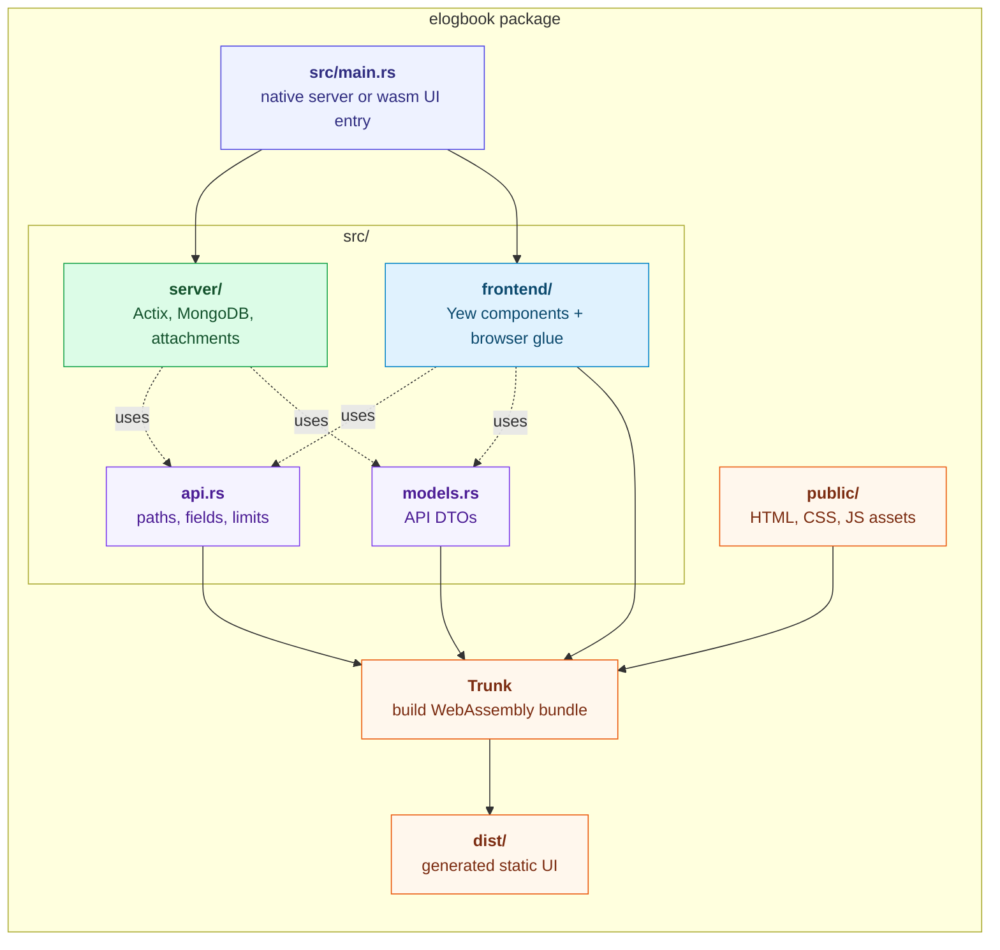
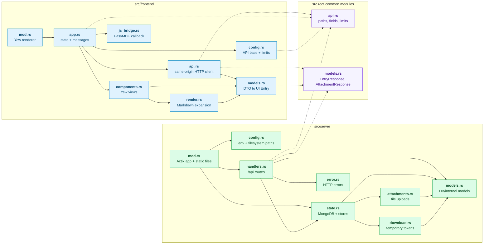
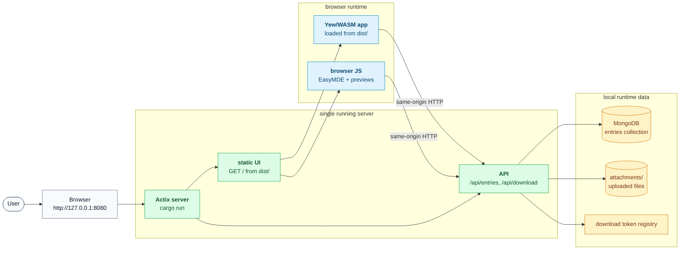
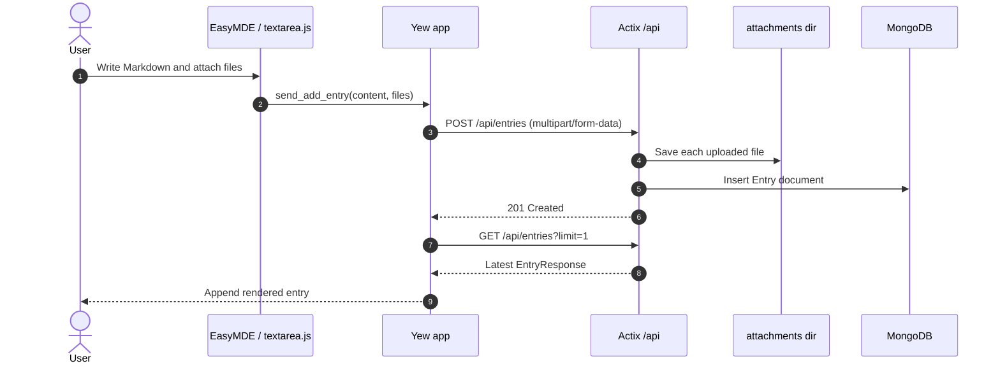
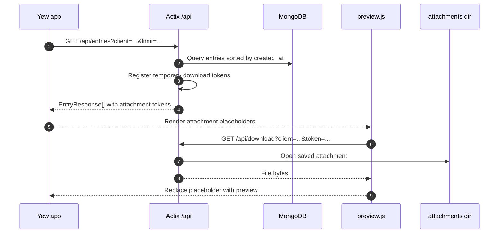

# Elogbook

A small electronic logbook for keeping chronological notes with Markdown and
file attachments. The application is intentionally simple: it behaves more like
a paper logbook than a threaded chat system.

## Project Layout

This repository is now a single Rust package. The source is still split by
responsibility, but the running application is one Actix server:

- `src/server/` - Actix, MongoDB access, attachment storage, API routes, and
  static file serving
- `src/frontend/` - Yew/WebAssembly UI code compiled by Trunk
- `src/api.rs` - shared API route constants, form field names, and limits
- `src/models.rs` - shared API DTOs used by both server and frontend
- `public/` - Trunk input assets: HTML, CSS, and browser JavaScript
- `dist/` - generated by `trunk build` and served by Actix; ignored by Git

Runtime data is deliberately kept out of Git. Local configuration lives in
`.env`, and uploaded files are stored under `attachments/`.



## Requirements

- Rust 1.88 or newer
- `wasm32-unknown-unknown` Rust target
- Trunk for building the Yew frontend
- MongoDB, either installed locally or run through Docker Compose

Useful setup commands:

```bash
rustup target add wasm32-unknown-unknown
cargo install trunk
```

## Module Map

The package has one Cargo manifest, with target-specific dependencies. Actix
dependencies are compiled for the native server target, while Yew/browser
dependencies are compiled for the WebAssembly target.



## Runtime Shape

Only one server is needed at runtime. Trunk builds the frontend into `dist/`;
Actix serves that static UI and the `/api/...` endpoints from the same origin.



## Configuration

Create a local environment file from the example:

```bash
cp .env.example .env
```

Then adjust the values as needed:

```dotenv
MONGODB_URI=mongodb://localhost:27017
DB_NAME=elogbook
SERVER_ADDR=127.0.0.1:8080
ATTACHMENTS_DIR=./attachments
WEB_DIR=./dist
```

The server stores new entries in the MongoDB `entries` collection. Attachments
are saved on disk and are served through short-lived download tokens.

## MongoDB Initialisation

For local development, the simplest option is Docker Compose:

```bash
docker compose up -d mongodb
```

This exposes MongoDB on `127.0.0.1:27017`, matching the default `.env.example`.

MongoDB creates the database and collection lazily, so no migration step is
required for a fresh local instance. On server start-up, the application also
ensures this index exists:

```javascript
db.entries.createIndex(
  { created_at: -1, _id: -1 },
  { name: "entries_by_created_at" }
)
```

If you prefer to initialise it manually:

```bash
mongosh mongodb://localhost:27017
```

```javascript
use elogbook
db.createCollection("entries")
db.entries.createIndex(
  { created_at: -1, _id: -1 },
  { name: "entries_by_created_at" }
)
```

For a local reset, discard the development database and uploaded files:

```bash
mongosh mongodb://localhost:27017 --eval 'db.getSiblingDB("elogbook").dropDatabase()'
rm -rf attachments/*
```

## Running Locally

Build the WebAssembly UI, then start the single Actix server:

```bash
trunk build
cargo run
```

Open:

```text
http://127.0.0.1:8080/
```

The server also exposes API endpoints for future external tools:

- `GET /api/health`
- `GET /api/entries?client=...&limit=...&offset=...`
- `POST /api/entries` with multipart fields `name`, `content`, and `file`
- `GET /api/download?client=...&token=...`
- `POST /api/download/extend?client=...`

## Data Flow

Adding an entry:



Loading and previewing entries:



## Development Checks

Run the native server checks from the repository root:

```bash
cargo fmt --all --check
cargo check
cargo test
cargo clippy --all-targets -- -D warnings
```

Check and build the WebAssembly UI:

```bash
cargo check --target wasm32-unknown-unknown
cargo clippy --target wasm32-unknown-unknown -- -D warnings
trunk build
```

If your shell exports `NO_COLOR=1` and Trunk rejects it, run:

```bash
env -u NO_COLOR trunk build
```
